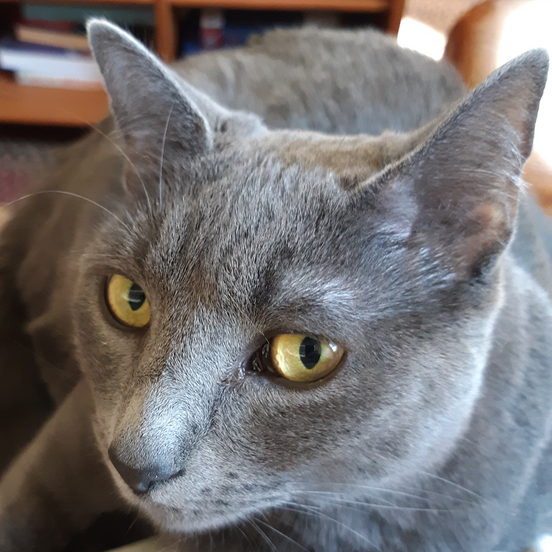
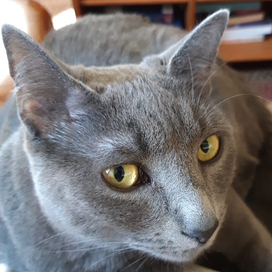
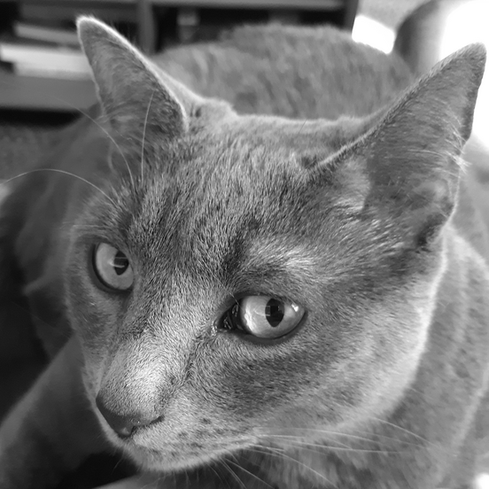
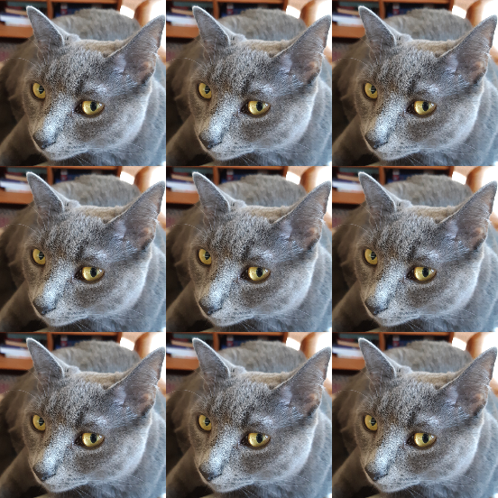
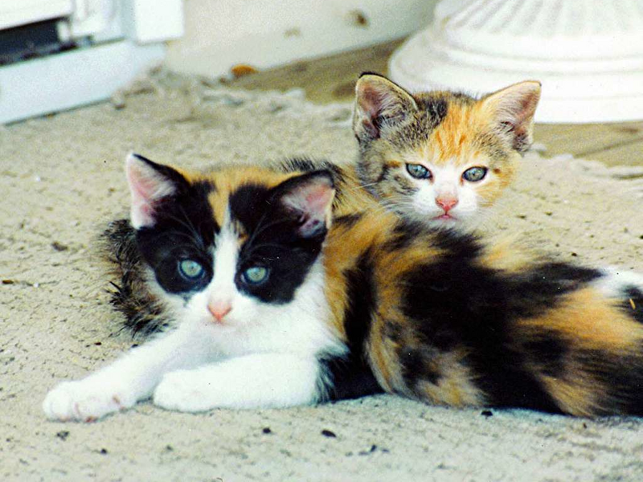
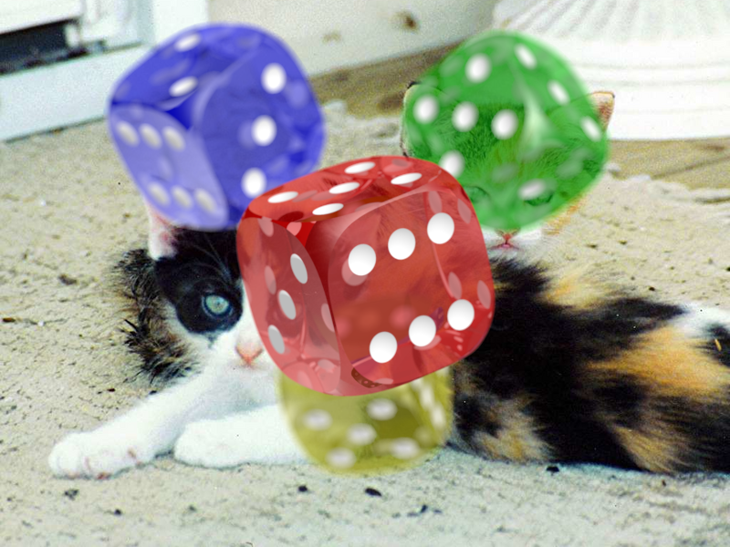

**Due**:

* Milestone 1 due **Monday, Sep 23rd** by 11 pm
* Milestone 2 due **Friday, Sep 27th** by 11 pm
* Milestone 3 due **Friday, Oct 4th** by 11 pm

This is a **pair** assignment, so you may work with one partner.

*Update 9/12*: some minor edits and clarifications.

*Update 9/15*: corrections to image processing program command line
syntax and examples.

*Update 9/16*: fixed some confusing language in the
[Color blending](#color-blending) section.

*Update 9/20*: changed Milestone 1 deadline to Monday, Sept. 23rd
so that feedback on Assignment 1 MS2 can be taken into account.

<div class='admonition danger'>
  <div class='title'>Warning!</div>
  <div class='content' markdown='1'>
Assembly language programming is challenging! Make sure
you start each milestone as soon as possible, work steadily, and
ask questions early.  Also, writing unit tests and using `gdb` to
examine the detailed behavior of code under test will be critical
to successful implementation of the assembly language functions.
  </div>
</div>

## Overview

In this assignment, you will implement transformations on image files,
using both C (in Milestone 1) and x86-64 assembly language (in Milestones 2 and 3.)

### Milestones

In Milestone 1, you are required to implement all of the image transformations
in C. You are also required to implement comprehensive unit tests for all of the
helper functions you use to implement the transformations. The intent is that
your assembly language code in Milestones 2 and 3 will implement the same
helper functions, and your unit tests will help you gain confidence in their
correctness.

In Milestone 2, you are required to implement the [`mirror_h`](#the-mirror_h-transformation),
[`mirror_v`](#the-mirror_v-transformation), and [`grayscale`](#the-grayscale-transformation)
transformations in assembly language. We expect you to have comprehensive unit tests
for the assembly language implementations of your helper functions. (In theory you can
just use the ones you implemented in Milestone 1.)

In Milestone 3, you will implement the [`composite`](#the-composite-transformation)
and [`tile`](#the-tile-transformation) transformations. Note that the assembly
language implementation of the tile transformation
is quite challenging, and is worth only 3% of the assignment grade.

Note that in each milestone, we expect all of the tests executed
by your unit test program to pass. For Milestone 2 in particular, you can
comment out calls to test functions that aren't related to
helper functions needed for Milestone 2. For example, for Milestone 2 your `imgproc_test.c`'s
`main` function might have code similar to the following:

```c
TEST( test_get_r );
TEST( test_get_g );
TEST( test_get_b );
TEST( test_get_a );
TEST( test_make_pixel );
TEST( test_to_grayscale );
//TEST( test_blend_components );
//TEST( test_blend_colors );
```

The tests for `get_r`, `get_g`, `get_b`, `get_a`, `make_pixel`, and
`to_grayscale` are enabled because they are all test functions involved
in the implementations of the `grayscale` transformation, which is
part of the requirements for MS2. The tests for `blend_components` and
`blend_colors` are commented out because they are used in the `composite`
transformation, which is not part of the requirements for MS2.

### Non-functional requirements

In Milestones 2 and 3, you will be writing assembly language functions.
You **must** write these "by hand", and your assembly code must have
very detailed code comments explaining the purpose of each assembly language
instruction.

It is **not** allowed to generate assembly
code using a C compiler and submit this as your own code. We will assign
a grade of 0 to any submissions containing compiler-generated code
where hand-written assembly language is expected.

Your submission for each milestone should include a `README.txt` file
describing how you and your partner divided the work, and letting
us know about any interesting implementation details. If there is
functionality you weren't able to get working completely, this is
a good place to mention that.

We expect you to follow the [style guidelines](style.html).
However, the expectations for function length will be relaxed considerably
for your assembly language code. It is not unusual for an assembly language
function to have 100 or more lines of code. In the reference solution,
the longest function was 115 lines, although there was extensive use of
comments and whitespace to improve readability.

Of course, you should strive to make your assembly language functions
as simple and readable as possible.

We expect your code to be free of memory errors. You should use
`valgrind` to test your code to make sure there are no uses
of uninitialized variables, out of bounds memory reads or writes,
etc.  This applies to both your C code and your assembly code.

### Grading breakdown

Milestone 1: 30%

* Implementation of C image transformation functions: 12.5%
* Unit testing of helper functions: 12.5%
* Design/coding style of C functions: 5%

Milestone 2: 45%

* Functional correctness of `imgproc_mirror_h`, `imgproc_mirror_v`, and `imgproc_grayscale`: 25%
* Unit testing of helper functions: 15%
* Design/coding style of assembly functions: 5%

Milestone 3: 25%

* Functional correctness of `imgproc_composite`: 17%
* Functional correctness of `imgproc_tile`: 3%
* Design/coding style of assembly functions: 5%

## Getting started

To get started, download [csf\_assign02.zip](csf_assign02.zip) and
unzip it.

You will implement the functions in `c_imgproc_fns.c` (Milestone 1)
and `asm_imgproc_fns.S` (Milestones 2 and 3.) You will also add
prototypes for helper functions to `imgproc.h` and implement additional
unit tests in `imgproc_tests.c`.

## Image processing

This section describes the image format and the image transformations
you will implement.

### struct Image

An instance of the `struct Image` data type represents a grid of
pixels, where each pixel has 8-bit red, green, and blue color
component values, as well as an 8-bit alpha value.

The `struct Image` type is defined as follows (in `image.h`):

```c
struct Image {
  int32_t width;
  int32_t height;
  uint32_t *data;
};
```

The `width` and `height` fields define the width and height of an image,
in pixels. The `data` field is a pointer to a dynamically-allocated array
of `uint32_t` values, each one representing one pixel. The pixels are stored
in row-major order, starting with the top row of pixels.

A color is represented by a `uint32_t` value as follows:

* Bits 24-31 are the 8 bit red component value, ranging from 0–255
* Bits 16-23 are the 8 bit green component value, ranging from 0–255
* Bits 8–15 are the 8 bit blue component value, ranging from 0–255
* Bits 0–7 are the 8 bit alpha value, ranging from 0–255

This pixel data format is known as "RGBA".

The alpha value of a color represents its opacity, with 255 meaning
"fully opaque" and 0 meaning "fully transparent". (See the
[Color blending](#color-blending) section for details on how
an alpha value allows two colors to be "blended".)

### Color blending

The color values of the output image are always fully opaque,
with an alpha value of 255. For the `composite` transformation,
the output image's pixels are a blend of the color values of the
"base" image (background) and the "overlay" image (foreground.)
For the pixels in the overlay image, each pixel's alpha value
represents a degree of opacity from 0 (fully transparent) to 255
(fully opaque.) So, in general, the colors of pixels in the output
image requires blending the base and overlay pixel colors.

To find the correct color value for a pixel in the output image, the
following computation is performed for
each color component, where $$f$$ is the foreground color component value,
$$b$$ is the background color component value, and $$\alpha$$ is the
alpha value of the foreground color:

$$\lfloor (\alpha f + (255 - \alpha)b) / 255 \rfloor$$

Note that the result of the division is truncated rather than being rounded,
so if you use integer division, it will behave in the expected way.

A blended color should have each color component value (red, green, and blue)
computed using the formula above, and the alpha value of the blended color
should be set to 255.

### Grayscale

In [the grayscale transformation](#the-grayscale-transformation), color pixels
are converted to gray pixels as follows. From the color pixel's red, green, and
blue color component values, denoted as $$r$$, $$g$$, and $$b$$, a "gray"
value, denoted $$y$$, is computed using the following formula:

$$y = \lfloor (79 \times r + 128 \times g + 49 \times b) / 256 \rfloor$$

The resulting gray pixel should have its red, green, and blue color component
values set to $$y$$, and its alpha value should be the same as the original
color pixel's alpha value.

### Image transformation functions

You will implement the following image transformation functions in both
C and assembly language:

```c
void imgproc_mirror_h( struct Image *input_img,
                       struct Image *output_img );
void imgproc_mirror_v( struct Image *input_img,
                       struct Image *output_img );
int imgproc_tile( struct Image *input_img,
                  int n, struct Image *output_img );
void imgproc_grayscale( struct Image *input_img,
                        struct Image *output_img );
int imgproc_composite( struct Image *base_img,
                       struct Image *overlay_img,
                       struct Image *output_img );
```

These functions are declared in `imgproc.h`, and each one has a detailed API
comment describing its function, the meaning of the parameters, and the
meaning of the return value (for the non-`void` functions.)

### The `mirror_h` transformation

The `mirror_h` transformation mirrors the input image horizontally.

Example images (click for full size):

Original image | Transformed image
:------------: | :---------------:
<a href="img/ingo.png"></a> | <a href="img/ingo_mirror_h.png"></a>

### The `mirror_v` transformation

The `mirror_v` transformation mirrors the input image vertically.

Example images (click for full size):

Original image | Transformed image
:------------: | :---------------:
<a href="img/ingo.png"></a> | <a href="img/ingo_mirror_v.png"></a>

### The `grayscale` transformation

The `grayscale` transformation converts a color image to grayscale.

The [Grayscale](#grayscale) section documents how color pixel values are
converted to grayscale pixel values.

Example images (click for full size):

Original image | Transformed image
:------------: | :---------------:
<a href="img/ingo.png"></a> | <a href="img/ingo_grayscale.png"></a>

### The `tile` transformation

The `tile` transformation generates an image containing an $$n$$ x $$n$$
arrangement of tiles, each tile being a smaller version of the original
image, and the overall result image having the same dimensions as the
original image. The value $$n$$ is the "tiling factor".

Example images with tiling factor $$n=3$$ (click for full size):

Original image | Transformed image
:------------: | :---------------:
<a href="img/ingo.png"></a> | <a href="img/ingo_tile_3.png"></a>

Note that when the image's width or height isn't evenly divisible by
$$n$$, the excess should be spread out evenly, starting with the leftmost tiles
(for excess width) and topmost tiles (for excess height).  For example,
in the 3 x 3 case for an 800x600 source image, the tile widths should
be 267, 267, and 266, and the tile heights should be 200, 200, and 200.

The tiles should sample every $$n$$th pixel from the source image
horizontally and vertically, starting with the pixel in the upper-left
corner of the original image.

### The `composite` transformation

The `composite` transformation overlays an "overlay" image on top of a "base"
image. Each pixel in the output image is determined by blending the corresponding
pixels of the base image (the "background" pixel) and overlay image (the
"foreground" pixel.) The foreground pixel's alpha value is used to
determine the relative contribution of the foreground and background pixels'
color component values to the color component values of the output pixel.
Each output pixel is fully opaque (alpha is 255.)

The [color blending](#color-blending) section describes how color blending should
be implemented.

As an example, consider the following base and overlay images
(click for full size):

Base image | Overlay image
:--------: | :-----------:
<a href="img/kittens.png"></a> | <a href="img/dice.png"></a>

Note that most of the pixels of the overlay image are either completely or partially
transparent, meaning that their alpha values are less than 255.

Compositing the two images produces the following result image
(click for full size):

<table>
 <tr>
   <th style="text-align: center;">Composite of base and overlay</th>
 </tr>
 <tr>
   <td>
<a href="img/kittens_composite_dice.png"></a>
   </td>
 </tr>
</table>

## `c_imgproc` and `asm_imgproc` programs

The `c_imgproc` and `asm_imgproc` programs apply one of the image transformations
to an input image (or, in the case of the `composite` transformation, two input images),
and write the result to an output image file.  The `c_imgproc_main.c` source file
implements both of these programs. The only difference between `c_imgproc` and
`asm_imgproc` is whether the image transformations are implemented in C
(`c_imgproc_fns.c`) or x86-64 assembly language (`asm_imgproc_fns.S`.)

To run these programs:

<div class='highlighter-rouge'><pre><code>./c_imgproc <i>transformation</i> <i>input.png</i> <i>output.png</i> [<i>argument</i>]
./asm_imgproc <i>transformation</i> <i>input.png</i> <i>output.png</i> [<i>argument</i>]
</code></pre></div>

In these commands:

* <code class='highlighter-rouge'><i>transformation</i></code> is the name of the
  image transformation to perform
* <code class='highlighter-rouge'><i>input.png</i></code> is the name of the input
  image file
* <code class='highlighter-rouge'><i>output.png</i></code> is the name of the output
  image file to write
* <code class='highlighter-rouge'>[<i>argument</i>]</code> is the
  argument needed by the transformation, if any (the tiling factor for the
  `tile` transformation, and the overlay image filename for the `composite`
  transformation)

For example, to run the `mirror_h` transformation using the `c_imgproc` program:

```text
mkdir -p actual
./c_imgproc mirror_h input/ingo.png actual/c_ingo_mirror_h.png
```

The above commands would apply the `mirror_h` transformation on the input image
`input/ingo.png` to produce the output image file `actual/c_ingo_mirror_h.png`.

Another example:

```text
mkdir -p actual
./c_imgproc composite input/kittens.png \
  actual/c_kittens_composite_dice.png input/dice.png
```

This second example runs the `composite` transformation using `input/kittens.png` as
the base image, `input/dice.png` as the overlay image, and generates the output
image file `actual/c_kittens_composite_dice.png`.

## Unit tests, helper functions

The source file `imgproc_tests.c` is a unit test program that you should use to
test the functions in `c_imgproc_fns.c` and `asm_imgproc_fns.S`.

The starter code has some very basic tests for the API functions implementing the
various image transformations. However, you will need to write unit tests for
your *helper functions*. The idea is that your assembly language code will implement
exactly the same helper functions as your C code, and having a comprehensive set
of unit tests for these helper functions will allow you to get your assembly code
working incrementally by implementing the helper functions one at a time.

<div class='admonition info'>
  <div class='title'>Tip</div>
  <div class='content' markdown='1'>
Having a good set of unit tests for your helper functions is essential for being
able to make steady progress towards getting your assembly code to work in
Milestones 2 and 3.
  </div>
</div>

You are free to implement whatever helper functions make sense. The reference
implementation defined the following helper functions:

```c
int all_tiles_nonempty( int width, int height, int n );
int determine_tile_w( int width, int n, int tile_col );
int determine_tile_x_offset( int width, int n, int tile_col );
int determine_tile_h( int height, int n, int tile_row );
int determine_tile_y_offset( int height, int n, int tile_row );
void copy_tile( struct Image *out_img, struct Image *img,
                int tile_row, int tile_col, int n );
uint32_t get_r( uint32_t pixel );
uint32_t get_g( uint32_t pixel );
uint32_t get_b( uint32_t pixel );
uint32_t get_a( uint32_t pixel );
uint32_t make_pixel( uint32_t r, uint32_t g, uint32_t b, uint32_t a );
uint32_t to_grayscale( uint32_t pixel );
uint32_t blend_components( uint32_t fg, uint32_t bg, uint32_t alpha );
uint32_t blend_colors( uint32_t fg, uint32_t bg );
```

## Image tests

The provided script `run_all.sh` runs your `c_imgproc` or `asm_imgproc` program
on some example input images and checks whether a correct output image
is produced. To run it:

```
./run_all.sh
```

## Hints and tips

### x86-64 tips

Here are some x86-64 assembly language tips and tricks in no particular order.

Callee-saved registers are your best option to serve as local variables
in your assembly language functions. The callee-saved registers are
`%r12`, `%r13`, `%r14`, `%r15`, `%rbx`, and `%rbp`. If you are going
to store data in a callee-saved register, make sure that you use `pushq`
to save its value at the beginning of the function, and `popq` to restore
its value at the end of the function. (The `popq` instructions must be in
the opposite order as the `pushq` instructions.)

If you run out of callee-saved registers, then you can use memory in the
stack frame to store local variables. We *highly* recommend using an ABI-compliant
stack frame to reserve memory for local variables, since that will allow
`gdb` to properly recognize the functions on the call stack. To do so,
your function's prologue code should look like this:

<div class='highlighter-rouge'><pre><code>pushq %rbp
movq %rsp, %rbp
subq $N, %rsp
<i>...push callee-saved registers...</i>
</code></pre></div>

This prologue will reserve *N* bytes of memory in the stack frame that
you can use for local variables. Note that all local variables in memory
should be accessed at *negative* offsets from `%rbp`. For example, if you
reserved 16 bytes for local variables, and you need space for four 4-byte
variables, you can refer to them as `-4(%rbp)`, `-8(%rbp)`, `-12(%rbp)`,
and `-16(%rbp)`.

Don't forget that the amount by which the stack pointer is
changed needs to be an odd multiple of 8 (so 8, or 24, or 40, etc.),
and that each `pushq` subtracts 8 from `%rsp`.
Also, don't  forget to pop back the original values of any saved
callee-saved registers, including `%rbp`. In general, your function
epilogue code should look like

<div class='highlighter-rouge'><pre><code><i>...pop callee-saved registers...</i>
addq $N, %rsp
popq %rbp
</code></pre></div>

Don't forget that you need to prefix constant values with `$`.  For example,
if you want to set register `%r10` to 16, the instruction is

```
movq $16, %r10
```

and not

```
movq 16, %r10
```

When calling a function, the stack pointer (`%rsp`) must contain an address
which is a multiple of 16.  However, because the `callq` instruction
pushes an 8 byte return address on the stack, on entry to a function,
the stack pointer will be "off" by 8 bytes.  You can subtract 8 from
`%rsp` when a function begins and add 8 bytes to `%rsp` before returning
to compensate.  Pushing an odd number of callee-saved registers also works,
and has the benefit that you can then use the callee-saved registers freely
in your function. Sometimes you may need to subtract 8 from `%rsp` even
if your function doesn't allocate storate for any local variables in memory,
just to ensure that `%rsp` is aligned correctly.

We *strongly* recommend that you have a comment in each function explaining
how it uses callee-saved registers and stack memory, since these are
the equivalent of local variables in assembly code. For example,
here is a comment taken from the implementation of the `copy_tile`
helper function in the reference solution:

<a name='register-memory-comment'>

```
/*
 * Register use:
 *   %r12 - pointer to output Image
 *   %r13 - pointer to source Image
 *   %r14d - tiling factor
 *   %r15d - tile pixel row
 *   %ebx - tile pixel column
 *
 * Memory use:
 *   -4(%rbp) - tile row index
 *   -8(%rbp) - tile column index
 *   -12(%rbp) - tile_w
 *   -16(%rbp) - tile_x_off
 *   -20(%rbp) - tile_h
 *   -24(%rbp) - tile_y_off
 */
```

Recall that your assembly language code must have detailed comments
explaining each line of assembly code. The following example
function illustrates the level of commenting that we expect to see:

```
/*
 * Determine the length of specified character string.
 *
 * Parameters:
 *   %rdi - pointer to a NUL-terminated character string
 *
 * Returns:
 *    number of characters in the string
 */
	.globl str_len
str_len:
	/* prologue to create ABI-compliant stack frame */
	pushq %rbp
	movq %rsp, %rbp

.Lstr_len_loop:
	cmpb $0, (%rdi)               /* found NUL terminator? */
	jz .Lstr_len_done             /* if so, done */
	inc %r10                      /* increment count */
	inc %rdi                      /* advance to next character */
	jmp .Lstr_len_loop            /* continue loop */

.Lstr_len_done:
	movq %r10, %rax               /* return count */

	/* epilogue */
	popq %rbp

	ret
```

As illustrated in the example function, labels for control flow
should be *local labels*, with names beginning with "`.L`".
If you don't use local labels within functions, debugging with
`gdb` will be difficult because `gdb` will think that each control
flow label is the beginning of a function.

### Debugging tips

You primary means of determining whether or not your code works correctly
is running the unit test programs (`c_imgproc_tests` and `asm_imgproc_tests`.)

If a unit test fails, you should use `gdb` to debug the code to determine
why it is not working.

Setting a breakpoint on the specific test function that is failing is
one way to start. For example, if the `test_to_grayscale` test function
is failing, in `gdb` set a breakpoint on that function, then run the
program so that it only runs that test function:

```
break test_to_grayscale
run test_to_grayscale
```

You will gain control of the program at the beginning of the test
function, at which point you can step through the code, inspect
variables, registers, and memory, etc.

Another good option for setting a breakpoint is the `tctest_fail`
function, because this is the function called when a test assertion
fails. For example, assuming `test_to_grayscale` has an assertion failure:

```
break tctest_fail
run test_to_grayscale
```

When the `tctest_fail` breakpoint is reached, use the `up` command (as many
times as needed) to enter the stack frame for the failing assertion.
This can allow you to check variables at the location of the assertion.

Don't forget that you can inspect register values in `gdb` by prefixing the
register name with the "`$`" character. For example:

```
print $ebx
```

would show you the contents of the `%ebx` register. Using `print/x` allows
you to see integer values in hexadecimal (very useful for checking color values.)

Casting a register to a pointer allows you to interpret memory as values
belonging to C data types. For example, let's say `%r10` points to a
`struct Image` instance. You could check the value of the element
at index 18 of the `data` array using the command

```
print/x ((struct Image *)$r10)->data[18]
```

If you are storing local variables in stack memory, and using `%rsp` to
access them, it is easy to see their values. In particular, if all of the
local variables are the same size and type (e.g., they are all
4-byte integers), then you can think of them as an array.
For example, in [the comment above about local variable allocation](#register-memory-comment),
there are 6 local variables allocated in stack memory, each of which
is a 4 byte integer value. We can see all of the values at once
with the `gdb` comamnd

```
print (unsigned [6]) *((unsigned *)($rbp - 24))
```

Here we are pretending that these variables belong to the `unsigned` type,
which is the same as the `uint32_t` type.  The `(unsigned [6])` at the
beginning of the expression tells `gdb` that we are interpreting the
memory as an array of 6 `unsigned` elements. We use the expression
`$rbp - 24` to compute the address of the beginning of the local variable
area, because it is 24 bytes in size, and `%rbp` points to the "top"
of the area. Note that the `print` command will show the values of the local
variables starting with the local variable with the "lowest" address, i.e.,
the one referred to as `-24(%rbp)`.

## Submitting

Before you upload your submission, make sure that your `README.txt`
contains the name of each team member and a brief summary of each team member's
contributions to the submission. If there is anything you would like us to
know about your submission, you can also add it to `README.txt`.

To prepare a zipfile for submission, run the command

```
make solution.zip
```

Please do not submit object files, executables, PNG image files,
or other files not mentioned above. (If you use `make solution.zip`
as recommended above, only the necessary files will be included in
the zipfile.)

Upload the zipfile to [Gradescope](https://www.gradescope.com) as
**Assignment 2 MS1**, **Assignment 2 MS2**, or **Assignment 2 MS3**, depending
on which milestone you are submitting.
